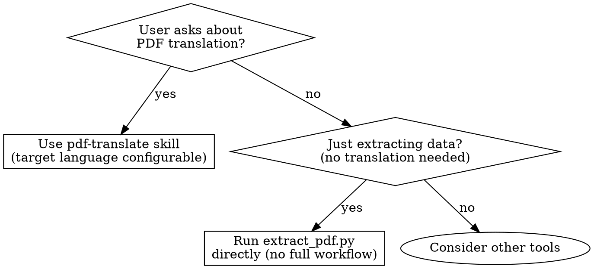

# PDF Translation Workflow (v2 — Optimized)

This skill defines an optimized pipeline for extracting, translating, and proofreading PDF documents into any target language using opencode's Task agents.

## When to Use



Only skip this skill when the user needs data extraction without any translation — run `extract_pdf.py` directly.

## Configuration

- **Target language**: User-specified at Phase 0. Default: `Chinese (中文)`.
  All prompts use `{target_lang}` — replace with the actual language name (e.g., "Chinese (中文)", "Japanese (日本語)") before sending prompts to agents.

## Prerequisites

| Dependency | Required For | Install |
|-----------|-------------|---------|
| pymupdf (fitz) | Phase 1: PDF text/image extraction, Phase 1.5: vector detection | `pip install pymupdf` |
| pdftocairo | Phase 1.5: vector-to-SVG conversion | `apt install poppler-utils` (Linux) / `brew install poppler` (macOS) |
| svgo (optional) | Phase 1.5: minify vector SVGs | `npm install -g svgo` |

## Workflow Overview

| Phase | Step | Description |
|-------|------|-------------|
| 0 | Setup | Create output directory, ask for target language, install dependencies |
| 1 | Extract | Extract text + raster images from PDF to JSON |
| 1.5 | Vectors | Extract vector graphics as SVG + PNG (for block diagrams, schematics) |
| 2 | Glossary | Build a terminology glossary before translating |
| 3 | Split | Split pages into batches of ~15 |
| 4 | Translate | Translate batches in parallel using Task agents |
| 5 | Merge | Merge translated batch files into one markdown |
| 6 | Proofread | Two-stage: mechanical validation + semantic review |
| 7 | Finalize | Produce the final polished document |

## Phase 0: Setup

1. Ask user for target language (default: Chinese/中文). Store as `{target_lang}`.

2. Install dependencies:

```bash
pip install pymupdf
# Check pdftocairo:
pdftocairo -v 2>&1 || echo "Install: apt install poppler-utils"
```

3. Create output directory:

```bash
mkdir -p <output_dir>/batches
```

Scripts referenced in later phases are bundled in this skill directory. Adjust paths to your skill installation:

```
pdf-translate/
├── extract_pdf.py          # Phase 1
├── extract_vectors.py      # Phase 1.5 (optional)
├── split_batches.py        # Phase 3
├── merge_batches.py        # Phase 5
└── validate_translation.py # Phase 6a
```

## Phase 1: Extract PDF Content

```bash
python path/to/pdf-translate/extract_pdf.py --input <pdf_path> --output <output_dir>
```

Verify: check `extracted_pages.json` contains all pages with text and image references.

## Phase 1.5: Extract Vector Graphics (Optional)

For PDFs that contain block diagrams, timing charts, schematics, or other vector-based figures, extract them as SVG (scalable) + PNG (fallback) using the bundled script.

This step is **optional** — skip if the PDF has only raster images or simple layout.

### How it works

1. `page.get_drawings()` detects vector path regions on each page
2. Text blocks are masked with white rectangles to isolate pure graphics
3. `pdftocairo -svg` converts the masked page to SVG (text-free)
4. Each detected vector region is clipped as a standalone SVG via viewBox windowing
5. A 300 DPI PNG fallback is rendered for quick markdown embedding

### Run

```bash
python path/to/pdf-translate/extract_vectors.py \
    --input <pdf_path> \
    --output <output_dir>
```

Optional flags:

| Flag | Default | Description |
|------|---------|-------------|
| `--pages "1-10"` | all | Process specific pages (comma-separated, ranges) |
| `--dpi 300` | 300 | PNG fallback resolution |
| `--min-area 5000` | 5000 | Minimum vector region area in pt² |
| `--gap 10` | 10 | Max gap (pt) for merging adjacent regions |

### Output

```
<output_dir>/vectors/
├── page_005_v01.svg      # Page 5, vector region 1 (scalable)
├── page_005_v01.png      # Page 5, vector region 1 (fallback)
├── page_005_v02.svg
├── page_005_v02.png
├── ...
└── manifest.json         # page → region → file mapping
```

### Embed in Translated Markdown

Translator agents should reference vector graphics:

```markdown

```

Prefer PNG for markdown embedding (universal renderer support) and keep SVG for high-resolution reference.

SVG files contain all page elements (not just the clipped region) — viewBox handles the visible window.  If you need smaller, self-contained SVGs, run [svgo](https://github.com/svg/svgo):
```bash
npx svgo --input vectors/ --output vectors/
```

---

## Phase 2: Build Terminology Glossary

**CRITICAL — Do this before any translation.** This ensures consistent terminology across all batches.

1. Scan the first 10-15 pages of extracted text.
2. Identify all technical terms: register names (RegXX), signal names (BUCK1, LDO3), pin names, acronyms, measurement units.
3. Create a glossary file `glossary.md` with two columns: `Source Term | Translation ({target_lang})`.
4. Key rules for the glossary:
   - **Register names**: Keep original (e.g., `Reg38` → `Reg38`)
   - **Signal/component names**: Keep original (e.g., `BUCK1`, `LDO3`, `PWRON`)
   - **Acronyms**: Translate with original in parentheses (e.g., `PMIC` → `PMIC ({target_lang} term in parentheses)`)
   - **Measurement units**: Keep as-is (V, A, mA, dB, MHz, kHz, Ω)
   - **Technical terms**: Standardize translations (e.g., `soft start` → `(standard {target_lang} term)`, `load transient` → `(standard {target_lang} term)`)
5. Read the glossary to the translator agent before each batch.

## Phase 3: Split Pages into Batches

```bash
python path/to/pdf-translate/split_batches.py --input <extracted_pages.json> --output <batches_dir> [--size 15]
```

Batch size guidelines by page density:

| Page characteristics | Suggested --size | Examples |
|---------------------|:---:|------|
| Heavy tables, register maps, signal definitions | 8-10 | PMIC datasheet, MCU reference manual |
| Moderate charts + text mix | 12-15 | Application note, technical whitepaper |
| Mostly prose, few figures | 18-20 | Software manual, standard document |
| Very sparse pages | 25-30 | Introductory doc, TOC pages |

When total pages ≤ 5, the script outputs a single batch — no parallelism needed.

## Phase 4: Translate Batches (Parallel)

### Key Optimization (v2 vs v1)

**v1 problem**: Each batch was translated in a separate session sequentially, requiring the user to start a new session for each batch.

**v2 optimization**: Launch all batch translations as parallel Task agents in a single session. Each agent:
1. Reads its batch JSON file
2. Reads the glossary for terminology consistency
3. Translates from the source language to {target_lang} markdown
4. Writes output to `<output_dir>/batches/batch_XX_translated.md`

### Agent Prompt Template

For each batch, use a Task agent with this prompt:

```
You are a technical translator. Translate batch {batch_id} (pages {first_page}-{last_page}) from the source language to {target_lang} markdown.

RULES:
1. Read the batch file at {batch_json_path}
2. Read the glossary at {glossary_path} — USE THESE TERMS EXACTLY
3. Output ONLY the translated content to {output_dir}/batches/batch_{batch_id}_translated.md
4. NEVER translate: register names, signal names, pin names, hex values, I2C addresses
5. Keep all numbers, units, formulas unchanged
6. Mark images with: 
7. Use markdown tables for tabular data
8. Trim header/footer boilerplate text (page numbers, copyright notices)
9. Quality requirements:
   - Register bit descriptions: preserve the exact bit field format
   - Electrical specs tables: preserve all columns (symbol, condition, min/typ/max, unit)
   - Keep line breaks and structure matching the original

DO NOT explain or summarize — output the translation directly.
```

Launch agents in parallel:

```
For each batch file in <output_dir>/batches/batch_*.json (excluding translated files):
  Launch a Task agent with the prompt template above, filling in batch-specific values.

Track all agent results. Retry any failed batches.
```

### v1 Anti-Pattern to Avoid

**Do NOT** store translated content inside Python scripts (e.g., `translate_batch04.py` with inline markdown). This was a v1 workaround. Always output directly to `.md` files.

## Phase 5: Merge Batches

```bash
python path/to/pdf-translate/merge_batches.py --batches <batches_dir> --output <draft.md>
```

Merges all `batch_*_translated.md` files in numeric order, with HTML comment separators
(`<!-- batch_NN start/end -->`) between batches.

## Phase 6: Proofread (Two-Stage)

### Phase 6a: Mechanical Checks (Script)

```bash
python path/to/pdf-translate/validate_translation.py \
    --draft <merged_draft.md> \
    --batches <batches_dir> \
    --images <images_dir> \
    [--glossary <glossary.md>]
```

Deterministic checks: image file existence, batch count matching, glossary term presence.
Outputs a PASS/FAIL report with structured issues.

### Phase 6b: Semantic Review (Agent)

After mechanical checks pass, launch a proofreading agent:

```
You are a technical proofreader reviewing a translated document. Mechanical checks passed.

Read the merged draft at {merged_draft_path}
Read the glossary at {glossary_path}
Reference source batches at {batches_dir}

Review for:
1. Terminology consistency — match glossary terms across all chapters
2. Translation accuracy — sample-check key technical paragraphs against source
3. {target_lang} fluency and readability
4. Heading hierarchy — no H1→H3 jumps
5. Table formatting — columns aligned, units preserved
6. Register/signal/pin name preservation — NOT translated

For each issue: section, line range, severity, suggested fix.
Output corrected file to {output_dir}/<document>_{target_lang}.md
```

## Phase 7: Finalize

Verify the final output:
- Reference the output from Phase 6b: `<output_dir>/<document>_translated.md`
- Total line count roughly corresponds to source page count
- All image references point to existing files (validated in Phase 6a)
- All register names matched
- No broken markdown tables
- Table of Contents section is complete

## Common Problems & Solutions (v1 Learnings)

| Problem (v1) | Root Cause | Solution (v2) |
|---|---|---|
| Translation stored in `.py` files | Agent chose Python as output format | Explicit instruction: output to `.md` files |
| Sequential batches = slow | One batch per session | Parallel Task agents |
| Inconsistent terms across chapters | No shared glossary | Phase 2: Glossary before translation |
| Need to review diffs between sessions | Incremental file edits | Batch-per-file output, merge at end |
| PDF tables corrupted in extraction | `get_text(sort=True)` misses cell boundaries | Check extraction quality; use sort=True (already correct) |
| Agent translation too literal | No translation guidelines | Detailed prompt with rules and examples |

## Execution Checklist

- [ ] Ask user for target language (default: Chinese/中文)
- [ ] Install dependencies (pymupdf, check pdftocairo)
- [ ] Create output directory
- [ ] Run `python extract_pdf.py --input <pdf> --output <dir>`
- [ ] (Optional) Run `extract_vectors.py --input <pdf> --output <dir>`
- [ ] Scan first pages → build `glossary.md` (show to user for approval)
- [ ] Run `python split_batches.py --input <json> --output <batches_dir> [--size 15]`
- [ ] Launch parallel Task agents for each batch (with glossary + {target_lang})
- [ ] Verify all `batch_*_translated.md` files exist
- [ ] Run `python merge_batches.py --batches <dir> --output <draft.md>`
- [ ] Run `python validate_translation.py` (Phase 6a: mechanical checks)
- [ ] Launch proofreading agent (Phase 6b: semantic review)
- [ ] Deliver final translated document
